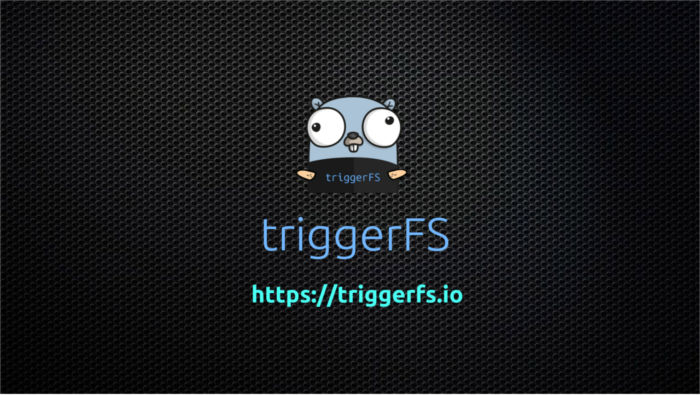
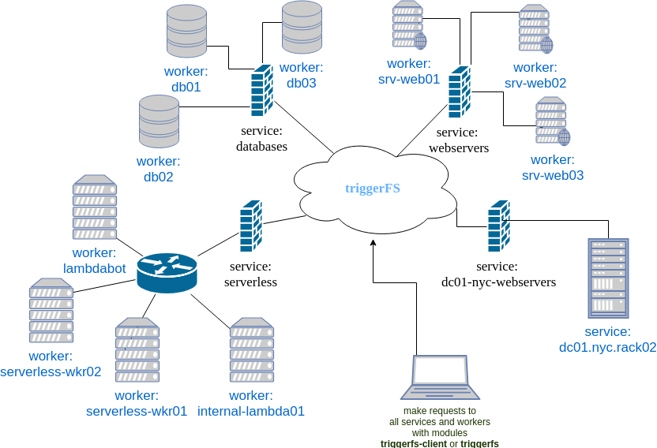

.. title:: triggerFS Documentation

TL;DR
#####

Imagine you could deploy your own customized services onto any server and map the API requests to it into regular files on your filesystem.
Imagine you could build a network of workers which you can do socket communication with via files.
Imagine you have a server out there which can make use of tons of plugins written in go and be able to do any kind of job and make requests to them in a service-oriented way.
Imagine how basically all applications able to write to a file could magically call all of your services and trigger something.

This is triggerFS. A ``triggerfs-worker`` running on a server, waiting for requests and ready to process them with the help of `plugins`.
Now from anywhere you can make those requests either by executing the ``triggerfs-client`` or by writing to regular files on your filesystem mounted anywhere with the help of the ``triggerfs`` module.

Check out our `Use Cases <usecases_examples.html#use-cases>`_ page to get a short overview what triggerFS is capable of.

Diagram
#######

Why triggerFS?
##############

TriggerFS is here to help you with the right tool. We don't want to invent anything new, we want to take already existing parts and put them together to build a system which can deliver the experience many people are looking for when:

- there is a new problem to be solved
- building distributed systems can actually be tricky
- suddenly automating things becomes relevant
- communication across boundaries is necessary but firewalls are in your way
- tasks need to be outsourced to other systems
- tasks need to be scheduled
- periodic tasks need to be run
- geo-replication is a topic
- a "serverless" design is taken into consideration
- lambda functions on own servers are needed
- fire&forget-style events could be needed
- wanting a central place where everything can be run (triggered) from

Benefits
--------

triggerFS offers you one more way to access your server or services on that server.
If ssh is the door to get into your server, think about triggerFS as a door to access various, selected services on that server.

triggerFS' ``fs`` module also helps to enable M2M (machine-to-machine) communication on embedded devices. Since writing to files is a cheap operation, 
embedded devices with limited resources can do socket communication easily with triggerFS.

By inviting other triggerFS users into your team you can collaborate with each other and share resources within the team.
For example: Different universities can come together and share their servers to do data crunching or data analysis.

By joining other teams you can share your services team-wide with other users of that team. This way you can make your service accessable only for a set of users.

By making your service public you can offer your service to the whole world. People can then access your services either with the triggerFS ``client`` module or 
the HTTP/broker gateway via HTTP to make requests to your service.

So let's dive into it.

   

.. toctree::
   :maxdepth: 2

.. toctree::
   :caption: What is triggerFS?

   intro.rst

.. toctree::
   :caption: Installation

   install.rst

.. toctree::
   :caption: Configuration

   configuration.rst

.. toctree::
   :caption: Plugins

   plugins.rst

.. toctree::
   :caption: Use Cases & Examples

   usecases_examples.rst

.. toctree::
   :caption: Marketplace

   marketplace.rst